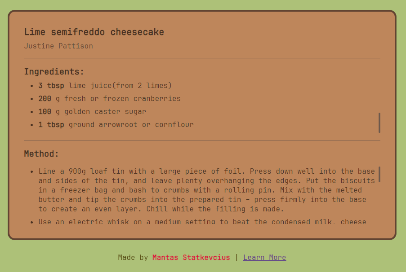
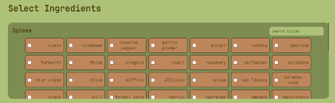

# Recipify
> Are you ever stuck for recipes? Check this out ^-^

**Recipify** is a non-api run recipe generator which uses BBCGoodFoods and contributors recipe datasets, some data manipultaion by Python and Javascript to append ingredients to the page, which can be used to narrow down recipe generation. If you like this project,  Star it! ⭐

## Features

* No API
* Generate Recipes
* Ingredients Search
* Contribution based (Submit recipes through the site)

## Bugs

If you encounter a bug submit an issue request to this repository.

## Links

-BBCGoodFoods Dataset: [File here](https://frosch.cosy.sbg.ac.at/datasets/json/recipes/-/blob/main/recipes.json?ref_type=heads)
- Project homepage: https://recipify.tech
- Repository: https://github.com/stkvs/recipify/
- Issue tracker: https://github.com/stkvs/recipify/issues
  - In case of sensitive bugs like security vulnerabilities, please contact
    stkvs@gmail.com directly instead of using issue tracker. We value your effort
    to improve the security and privacy of this project!
- Related projects:
  - Your other project: https://github.com/stkvs/interactive-saturn
  - Another project: https://github.com/saolghra/atmosify | https://atmosify.tech
